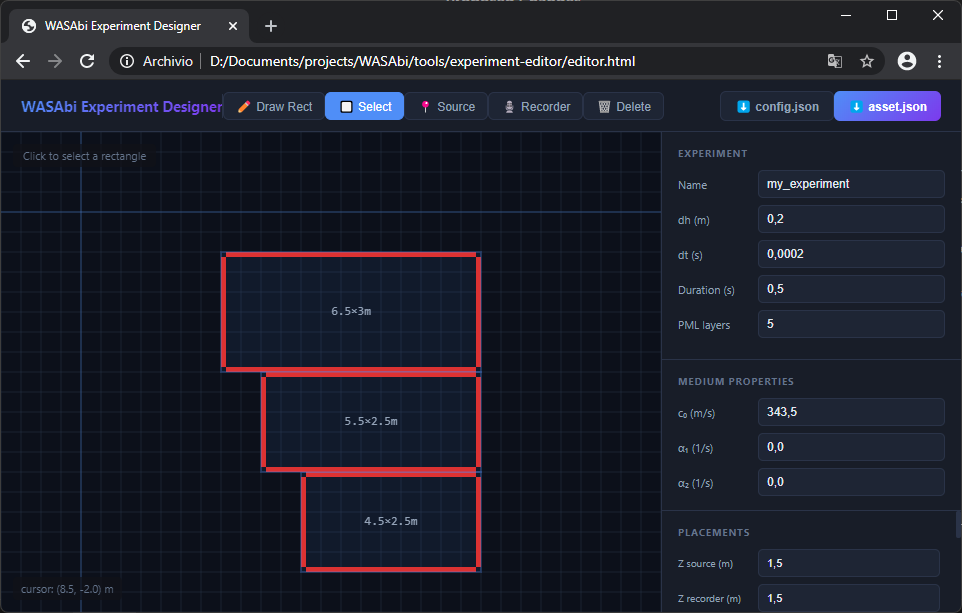

<p align="center">
  
</p>

# WASAbi - a Wave-based Acoustic Simulator using ARD

C++ implementation of Adaptive Rectangular Decomposition (ARD) with frequency-dependent atmospheric absorption in 2.5D (3D with constant height).

Theory:
> Gerardo Cicalese, Gabriele Ciaramella, Ilario Mazzieri; Addressing atmospheric absorption in adaptive rectangular decomposition. J. Acoust. Soc. Am. 1 October 2024; 156 (4): 2328–2339. [https://doi.org/10.1121/10.0030468](https://doi.org/10.1121/10.0030468)

---

## 🚀 The WASAbi Pipeline

WASAbi is structured around a three-stage workflow: **Design**, **Simulate**, and **Analyze**.

### 1️⃣ DESIGN: Experiment Designer
Before running a simulation, use the web-based **Experiment Designer** to create your geometry and transducer layout.

<p align="center">
  
</p>

- **Location**: `tools/experiment-editor/editor.html` (Open in any modern browser).
- **Features**:
    - Interactive 2D drawing of rectangular partitions.
    - **Dynamic Resizing**: Drag edges of selected rectangles to resize.
    - **Project Loading**: Use the **📂 Load** button to import existing `config.json` or `asset.json` files for modification.
    - Real-time **CFL Stability Warning** (`c₀ · dt / dh > 0.6`).
    - Visual feedback for face-specific absorption coefficients.
    - Export standardized `asset.json` and `config.json`.

### 2️⃣ SIMULATE: CUDA Core
Run the high-performance CUDA simulation engine.

**📂 Experiment Structure:**
Each experiment lives in `experiments/[name]/`:
- `asset.json`: Geometry, sources, recorders, and **medium properties** (c₀, α₁, α₂).
- `config.json`: Numeric parameters (dh, dt, duration, viz_skip).
- `output/`: Binary files containing simulation results.

**🚀 Execution:**
Use the batch files in the root for quick execution:
- `run_sim_viz.bat`: Run simulation with real-time visualization.
- `run_sim_record_response.bat`: Run simulation and record RIR.
- `run_sim_record_field.bat`: Run simulation and record full pressure field.
- `run_viz_record.bat`: Visualize a previously recorded field.

*Tip: Modify `experiment_name.txt` in the root to change the default experiment name for these scripts.*

Or run manually:
```cmd
.\build\WASAbiApp.exe --experiment hall --mode sim-viz
```

### 3️⃣ ANALYZE: MATLAB Post-Processing
Analyze binary output data using tools in `tools/postprocessing/`.

- **`rir.m`**: Compute Room Impulse Responses, Energy Decay Curves (EDC), and acoustic parameters.
- **`visualize_field.m`**: Render the 3D pressure field propagation from recorded data.

---

## 🛠️ Configuration Schemas

### 🧱 Assets (`asset.json`)
Defines the spatial layout and medium characteristics.
```json
{
    "medium_properties": {
        "c0": 343.5,
        "alpha1": 0.0,
        "alpha2": 1e-6
    },
    "partitions": [
        { 
          "x": 0, "y": 0, "z": 0, "w": 30, "h": 10, "d": 3,
          "boundary_absorption": { "x_minus": 0.1, "x_plus": 0.1, ... }
        }
    ],
    "sources": [{ "type": "gaussian", "x": 15, "y": 5, "z": 1.5 }],
    "recorders": [{ "x": 10, "y": 5, "z": 1.5 }]
}
```

### ⚙️ Numerical Config (`config.json`)
Defines the simulation engine parameters.
```json
{
    "simulation": {
        "duration": 0.5,
        "dh": 0.2,
        "dt": 0.0002,
        "n_pml_layers": 5
    },
    "visualization": {
        "viz_skip": 10,
        "max_viz_gain": 20
    }
}
```

---

## 🏗️ Building WASAbi

### 🟢 Prerequisites
- **NVIDIA GPU** (Compute Capability 6.1+).
- **CUDA Toolkit** (Tested with v12.4).
- **Visual Studio 2022** with MSVC.

### 🪟 Windows Build
```cmd
.\build_cuda.bat
```
6. This builds `WASAbiApp.exe` into `build/`.
